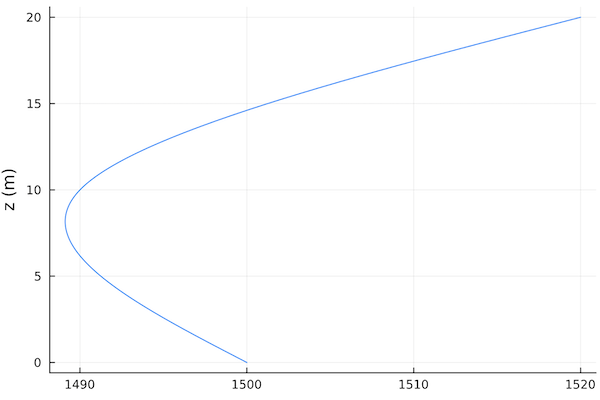
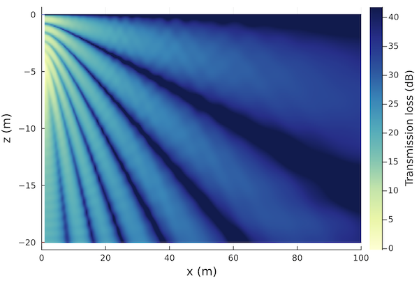

# Propagation modeling toolkit

## Overview

The _underwater acoustic propagation modeling & simulation toolkit_ provides a framework for modeling and simulating underwater acoustic environments with multiple sources and receivers. The toolkit provides a pluggable interface that allows different propagation models to be used with the same scene description. While `UnderwaterAcoustics.jl` provides several propagation model implementations that can be used out-of-the-box, the interface is designed to allow third party propagation models to be easily plugged in to the toolkit as well.

Available models:

| Model | Description | Language | Strengths | Limitations |
|-------|-------------|----------|-----------|-------------|
| [PekerisRayModel](@ref) | Analytical ray model for Pekeris waveguides | Julia | Fast, differentiable, multi-threaded | Isovelocity, range independent |
| [RaySolver](@ref) | Ray/Gaussian beam model | Julia | Differentiable, multi-threaded | Tell us and we'll fix them! |
| [Bellhop](@ref) | Interface to [OALIB Bellhop model](http://oalib.hlsresearch.com/AcousticsToolbox/) | FORTRAN | Well established benchmark model | Does not support automatic differentiation |
| [Kraken](@ref) | Normal mode model, interface to [OALIB Kraken model](http://oalib.hlsresearch.com/AcousticsToolbox/) | FORTRAN | Allow modeling for low-frequency applications| Does not support automatic differentiation and range-dependent bathymetry |

## Quickstart guide

Let's get started:
```julia-repl
julia> using UnderwaterAcoustics
```

### Define an environment

First, let's setup an environment description.

```julia-repl
julia> env = UnderwaterEnvironment()
BasicUnderwaterEnvironment:
  altimetry = FlatSurface()
  bathymetry = ConstantDepth{Float64}(20.0)
  ssp = IsoSSP{Float64}(1539.0866009307247)
  salinity = 35.0
  seasurface = SurfaceLoss{Float64}(2.6)
  seabed = RayleighReflectionCoef{Float64,Float64,Float64}(1.169, 0.9999, 0.01261)
  noise = RedGaussianNoise{Float64}(1.0e6)
```

Environments are immutable, so you have to customize them during construction. For example:
```julia-repl
julia> env = UnderwaterEnvironment(
         seasurface = Vacuum,
         seabed = SandyClay,
         ssp = SampledSSP(0.0:20.0:40.0, [1500.0, 1490.0, 1520.0], :smooth),
         bathymetry = ConstantDepth(40.0)
       )
BasicUnderwaterEnvironment:
  altimetry = FlatSurface()
  bathymetry = ConstantDepth{Float64}(40.0)
  ssp = SampledSSP{Float64,Float64,linear}(3 points)
  salinity = 35.0
  seasurface = ReflectionCoef{Float64}(-1.0)
  seabed = RayleighReflectionCoef{Float64,Float64,Float64}(1.147, 0.9849, 0.00242)
  noise = RedGaussianNoise{Float64}(1.0e6)
```

If you have `Plots.jl` installed, you can use plot recipes to plot the environment or the soundspeed profile. For example:
```julia-repl
julia> using Plots
julia> plot(ssp(env))
```


### Selecting a model

Once you have an environment, you need to select a propagation model. To get a list of all available models:
```julia-repl
julia> models()
4-element Array{Any,1}:
 PekerisRayModel
 RaySolver
 Bellhop
 Kraken
```

NOTE: `Bellhop` will only be available if you have a working copy of OALIB `bellhop.exe` available on your PATH. `Kraken` will only be available if you have a working copy of OALIB `kraken.exe` and `field.exe` available on your PATH.

Once you have an environment, you can select a model that can work with that environment:
```julia-repl
julia> models(env)
2-element Array{Any,1}:
 RaySolver
 Bellhop
```

In this case, we got a shorter list back because the `PekerisRayModel` can't deal with non-isovelocity SSP. We can confirm this by creating an iso-velocity environment:
```julia-repl
julia> env = UnderwaterEnvironment()
BasicUnderwaterEnvironment:
  altimetry = FlatSurface()
  bathymetry = ConstantDepth{Float64}(20.0)
  ssp = IsoSSP{Float64}(1539.0866009307247)
  salinity = 35.0
  seasurface = SurfaceLoss{Float64}(2.6)
  seabed = RayleighReflectionCoef{Float64,Float64,Float64}(1.169, 0.9999, 0.01261)
  noise = RedGaussianNoise{Float64}(1.0e6)

julia> models(env)
2-element Array{Any,1}:
 PekerisRayModel
 RaySolver
```

This time you see that `Bellhop` wasn't included, as it assumes a `Vacuum` surface by default and we have a `SeaState1` surface as our default.

Let's pick a 7-ray Pakeris ray model for now:
```julia-repl
julia> pm = PekerisRayModel(env, 7)
PekerisRayModel with BasicUnderwaterEnvironment:
  altimetry = FlatSurface()
  bathymetry = ConstantDepth{Float64}(20.0)
  ssp = IsoSSP{Float64}(1539.0866009307247)
  salinity = 35.0
  seasurface = SurfaceLoss{Float64}(2.6)
  seabed = RayleighReflectionCoef{Float64,Float64,Float64}(1.169, 0.9999, 0.01261)
  noise = RedGaussianNoise{Float64}(1.0e6)
```

If you wanted the ray solver instead, you'd do `pm = RaySolver(env)`, or for a Bellhop model, you'd do `pm = Bellhop(env)`. Both models can take additional keyword parameters that can customize the solver.

### Defining sources and receivers

Now, we need a source and a receiver:
```julia-repl
julia> tx = AcousticSource(0.0, -5.0, 1000.0);
julia> rx = AcousticReceiver(100.0, -10.0);
```

This defines an omnidirectional 1 kHz transmitter `tx` at a depth of 5 m at the origin, and an omnidirectional receiver at a range of 100 m and a depth of 10 m.

NOTE: All coordinates are specified in meters as (x, y, z) for 3D or (x, z) for 2D. The coordinate system has `x` and `y` axis in the horizontal plane, and `z` axis pointing upwards, with the nominal water surface being at 0 m. This means that all `z` coordinates in water are negative.

### Ray tracing

Now that we have an environment, a propation model, a transmitter and a receiver, we can modeling. First, we ask for all eigenrays between the transmitter and receiver:
```julia-repl
julia> r = eigenrays(pm, tx, rx)
7-element Array{UnderwaterAcoustics.RayArrival{Float64,Float64},1}:
 ∠ -2.9°  0↑  0↓ ∠  2.9° |  65.05 ms | -40.0 dB ϕ  -0.0° ⤷
 ∠  8.5°  1↑  0↓ ∠  8.5° |  65.70 ms | -40.1 dB ϕ-180.0° ⤷
 ∠-14.0°  0↑  1↓ ∠-14.0° |  66.97 ms | -59.0 dB ϕ  60.5° ⤷
 ∠ 19.3°  1↑  1↓ ∠-19.3° |  68.84 ms | -61.3 dB ϕ-141.7° ⤷
 ∠-24.2°  1↑  1↓ ∠ 24.2° |  71.25 ms | -62.3 dB ϕ-153.8° ⤷
 ∠ 28.8°  2↑  1↓ ∠ 28.8° |  74.15 ms | -63.0 dB ϕ  19.4° ⤷
 ∠-33.0°  1↑  2↓ ∠-33.0° |  77.49 ms | -85.4 dB ϕ-149.4° ⤷
```

For each eigenray, this shows us the launch angle, number of surface bounces, number of bottom bounces, arrival angle, travel time, transmission loss along that ray, and phase change. The last "`⤷`" symbol indicates that the complete ray path is also available. We can plot the ray paths:
```julia-repl
julia> plot(env; sources=[tx], receivers=[rx], rays=r)
```


Th red star is the transmitter and the blue circle is the receiver. The stronger eigenrays are shown in blue, while the weaker ones are shown in red.

We might sometimes want to see all rays from the transmitter at certain angular spacing (-45°:5°:45°) and a given range (100 m):
```julia-repl
julia> r = rays(pm, tx, -45°:5°:45°, 100.0)
19-element Array{UnderwaterAcoustics.RayArrival{Float64,Float64},1}:
 ∠-45.0°  2↑  3↓ ∠-45.0° |  91.89 ms | -109.6 dB ϕ  27.5° ⤷
 ∠-40.0°  2↑  2↓ ∠ 40.0° |  84.82 ms | -86.8 dB ϕ  22.1° ⤷
 ∠-35.0°  1↑  2↓ ∠-35.0° |  79.32 ms | -85.9 dB ϕ-152.3° ⤷
 ∠-30.0°  1↑  2↓ ∠-30.0° |  75.03 ms | -85.2 dB ϕ-143.9° ⤷
 ∠-25.0°  1↑  1↓ ∠ 25.0° |  71.69 ms | -62.8 dB ϕ-155.2° ⤷
 ∠-20.0°  1↑  1↓ ∠ 20.0° |  69.14 ms | -61.9 dB ϕ-143.9° ⤷
 ∠-15.0°  0↑  1↓ ∠-15.0° |  67.27 ms | -59.6 dB ϕ  55.5° ⤷
 ⋮
 ∠ 15.0°  1↑  1↓ ∠-15.0° |  67.27 ms | -60.0 dB ϕ-124.5° ⤷
 ∠ 20.0°  1↑  1↓ ∠-20.0° |  69.14 ms | -61.9 dB ϕ-143.9° ⤷
 ∠ 25.0°  2↑  1↓ ∠ 25.0° |  71.69 ms | -63.1 dB ϕ  24.8° ⤷
 ∠ 30.0°  2↑  1↓ ∠ 30.0° |  75.03 ms | -63.6 dB ϕ  18.1° ⤷
 ∠ 35.0°  2↑  2↓ ∠-35.0° |  79.32 ms | -86.2 dB ϕ  27.7° ⤷
 ∠ 40.0°  2↑  2↓ ∠-40.0° |  84.82 ms | -86.8 dB ϕ  22.1° ⤷
 ∠ 45.0°  3↑  2↓ ∠ 45.0° |  91.89 ms | -87.7 dB ϕ-161.7° ⤷

julia> plot(env; sources=[tx], rays=r)
```


### Arrivals & transmission loss

Often, we are interested in the arrival structure or transmission loss at a receiver. Getting the arrivals is quite similar to getting eigenrays, but the ray paths are not stored:
```julia-repl
julia> a = arrivals(pm, tx, rx)
7-element Array{UnderwaterAcoustics.RayArrival{Float64,Missing},1}:
 ∠ -2.9°  0↑  0↓ ∠  2.9° |  65.05 ms | -40.0 dB ϕ  -0.0°
 ∠  8.5°  1↑  0↓ ∠  8.5° |  65.70 ms | -40.1 dB ϕ-180.0°
 ∠-14.0°  0↑  1↓ ∠-14.0° |  66.97 ms | -59.0 dB ϕ  60.5°
 ∠ 19.3°  1↑  1↓ ∠-19.3° |  68.84 ms | -61.3 dB ϕ-141.7°
 ∠-24.2°  1↑  1↓ ∠ 24.2° |  71.25 ms | -62.3 dB ϕ-153.8°
 ∠ 28.8°  2↑  1↓ ∠ 28.8° |  74.15 ms | -63.0 dB ϕ  19.4°
 ∠-33.0°  1↑  2↓ ∠-33.0° |  77.49 ms | -85.4 dB ϕ-149.4°
```

If we prefer, we can plot these arrivals as an impulse response (sampled at 44.1 kSa/s, in this case):
```julia-repl
julia> plot(abs.(impulseresponse(a, 44100; reltime=true)); xlabel="Sample #", legend=false)
```


The `reltime=true` option generates an impulse response with time relative to the first arrival (default is relative to transmission time).

If we want, we can also get the complex transfer coefficient or the transmission loss in dB:
```julia-repl
julia> transfercoef(pm, tx, rx)
0.013183979186458052 - 0.012267750240848727im

julia> transmissionloss(pm, tx, rx)
34.89032959932541
```

You can also pass in arrays of sources and receivers, if you want many transmission losses to be computed simultanously. Some models are able to compute transmission loss on a Cartesion grid very efficiently. This is useful to plot transmission loss as a function of space.

To define a 1000×200 Cartesion grid with 0.1 m spacing:
```julia-repl
julia> rx = AcousticReceiverGrid2D(1.0, 0.1, 1000, -20.0, 0.1, 200)
1000×200 AcousticReceiverGrid2D{Float64}:
 BasicAcousticReceiver((1.0, 0.0, -20.0))    …  BasicAcousticReceiver((1.0, 0.0, -0.1))
 BasicAcousticReceiver((1.1, 0.0, -20.0))       BasicAcousticReceiver((1.1, 0.0, -0.1))
 BasicAcousticReceiver((1.2, 0.0, -20.0))       BasicAcousticReceiver((1.2, 0.0, -0.1))
 ⋮                                           ⋱
 BasicAcousticReceiver((100.7, 0.0, -20.0))     BasicAcousticReceiver((100.7, 0.0, -0.1))
 BasicAcousticReceiver((100.8, 0.0, -20.0))     BasicAcousticReceiver((100.8, 0.0, -0.1))
 BasicAcousticReceiver((100.9, 0.0, -20.0))     BasicAcousticReceiver((100.9, 0.0, -0.1))
```

We can then compute the transmission loss over the grid:
```julia-repl
julia> x = transmissionloss(pm, tx, rx)
1000×200 Array{Float64,2}:
 19.0129  19.12    19.5288  …   9.02602   8.23644   8.86055  11.1436  16.4536
 19.017   19.1239  19.5324      9.02506   8.26487   8.90641  11.2     16.5155
 19.0217  19.1284  19.5366  …   9.02392   8.29514   8.95536  11.2602  16.5817
 19.0271  19.1336  19.5415      9.0226    8.32706   9.00713  11.3239  16.6519
  ⋮                 ⋮       ⋱              ⋮                           ⋮
 35.5238  35.4909  35.4954     56.1556   57.7909   59.9858   63.1631  68.5643
 35.5742  35.5448  35.5526  …  56.5185   58.1488   60.3365   63.5039  68.8852
 35.6261  35.6     35.611      56.8971   58.522    60.7023   63.8594  69.2206
 35.6793  35.6565  35.6704     57.2926   58.9118   61.0841   64.2306  69.5712

julia> plot(env; receivers=rx, transmissionloss=x)
```


### Acoustic simulations

Apart from propagation modeling, we can also setup a simulation with various sources and receviers.

We demonstrate this by setting up a scenario with two pingers (1 kHz, 10 ms pulse with 1 Hz PRR; 2 kHz, 20 ms pulse with 2 Hz PRR) with a source level of 170 dB re µPa @ 1m, at two locations, and deploying two omnidirectional receviers to record them:
```julia-repl
julia> using DSP: db2amp
julia> tx = [
  Pinger(0.0, 0.0, -5.0, 1000.0; interval=1.0, duration=10e-3, sourcelevel=db2amp(170)),
  Pinger(0.0, 100.0, -5.0, 2000.0; interval=0.5, duration=20e-3, sourcelevel=db2amp(170))
]

julia> rx = [
  AcousticReceiver(100.0, 0.0, -10.0);
  AcousticReceiver(50.0, 20.0, -5.0)
];
```

To carry out the simulation, we can for a 2-second long recording (at 8 kSa/s) at the receivers:
```julia-repl
julia> s = record(pm, tx, rx, 2.0, 8000.0)
SampledSignal @ 8000.0 Hz, 16000×2 Array{Complex{Float64},2}:
  127308.0+884666.0im   1.15927e6-548579.0im
 -263820.0+1.16962e6im   1.1377e6+541803.0im
  -80980.6+1.16562e6im   657226.0+738712.0im
          ⋮
 -447370.0+910253.0im    163952.0-436691.0im
 -431239.0+903852.0im    100509.0-118066.0im
 -391797.0+582705.0im     49383.0-679981.0im
```

The signals are returned as complex analytic signals, but can be easily converted to real signals, if desired:
```julia-repl
julia> s = real(s)
SampledSignal @ 8000.0 Hz, 16000×2 Array{Float64,2}:
 -672702.0   318731.0
 -825049.0   377382.0
 -984626.0   214490.0
       ⋮
   66193.3  -497239.0
 -144031.0  -321312.0
 -260200.0  -235680.0
```

To visualize the recording, we plot a spectrogram of the signal at the first receiver with the `SignalAnalysis.jl` package:
```julia-repl
julia> using SignalAnalysis
julia> specgram(s[:,1])
```


We can clearly see the two pingers, as well as the ambient noise generated with the noise model defined in the environment description.
