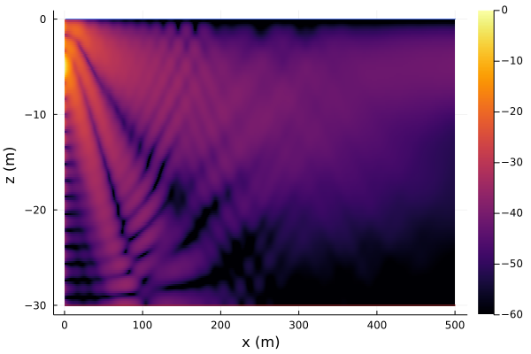

# Kraken

```@meta
CurrentModule = UnderwaterAcoustics
```

!!! note

    To use Kraken, you first need to install [OALIB Kraken](http://oalib.hlsresearch.com/AcousticsToolbox/) and ensure you have `kraken.exe` and `field.exe` available on your `PATH`.

Kraken is an interface to the [OALIB Kraken](http://oalib.hlsresearch.com/AcousticsToolbox/) normal mode model for low-frequency acoustic propagation modeling. If `UnderwaterAcoustics` can find `kraken.exe` and `field.exe`, the Kraken model will be available:

```julia-repl
julia> models()
4-element Array{Any,1}:
 PekerisRayModel
 RaySolver
 Bellhop
 Kraken
```

Additional options available with [`Kraken`](@ref):

- `nmodes` -- maximum number of modes (default: 9999)
- `nmedia` -- number of medium (default: 1)
- `nmesh` -- number of mesh point to use initially, set to 0 to allow code calculate `nmesh` automatically.(default: 0)
- `clow` -- lower phase speed limit, set to 0 to allow code calculate `clow` automatically. (default: `0.0 m/s`)
- `chigh` -- higher phase speed limit, the larger `chigh` is, the more modes are calculated. Choice of `chigh` becomes a matter of experience. (default: `1600.0 m/s`)
- `debug` -- if `true`, intermediate Kraken files are made available for user inspection (default: `false`)

**Example:**

```julia
using UnderwaterAcoustics
using Plots

env = UnderwaterEnvironment(
  seasurface = Vacuum,
  seabed = SandyClay,
  ssp = SampledSSP(0.0:15.0:30.0, [1447.0, 1455.0, 1460.0], :smooth),
  bathymetry =  ConstantDepth(30.0)
)
pm = Kraken(env)
tx = AcousticSource(0.0, -5.0, 1000.0)
rx = AcousticReceiverGrid2D(1.0, 0.1, 5000, -30.0, 0.2, 150)
x = transmissionloss(pm, tx, rx)

plot(env; receivers=rx, transmissionloss=x, clims = (-60.0,0.0))
```



For more information on how to use the propagation models, see [Propagation modeling toolkit](@ref).
