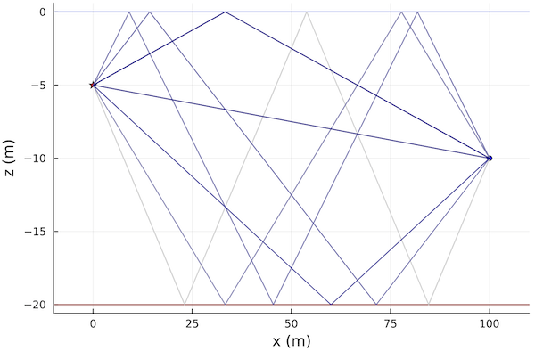

# PekerisRayModel

```@meta
CurrentModule = UnderwaterAcoustics
```

The Pekeris ray model is a very fast fully differentiable 2D/3D ray model for isovelocity range-independent environments. The only parameter that has to be specified when creating the model is the desired number of rays.

**Example:**

```julia
using UnderwaterAcoustics
using Plots

env = UnderwaterEnvironment(
  seasurface = SeaState2,
  seabed = SandyClay
)
pm = PekerisRayModel(env, 7)    # 7-ray model
tx = AcousticSource(0.0, -5.0, 1000.0)
rx = AcousticReceiver(100.0, -10.0)
r = eigenrays(pm, tx, rx)
plot(env; sources=[tx], receivers=[rx], rays=r)
```



For more information on how to use the propagation models, see [Propagation modeling toolkit](@ref).
