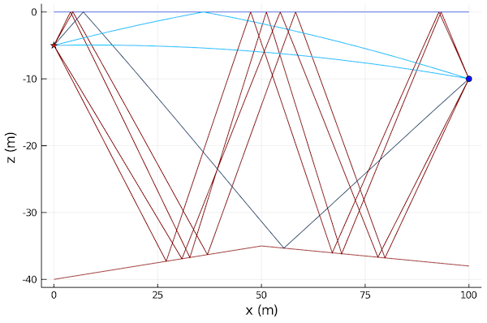

# RaySolver

```@meta
CurrentModule = UnderwaterAcoustics
```

!!! note

    The RaySolver model is experimental and being actively developed, and should be considered as a **beta release** at present. Feedback and bug reports are welcome.

The RaySolver is a differentiable 2½D Gaussian beam tracer. It is similar to [Bellhop](@ref), but fully written in Julia to be compatible with [`ForwardDiff`](https://github.com/JuliaDiff/ForwardDiff.jl), [`Measurements`](https://github.com/JuliaPhysics/Measurements.jl), [`Turing`](https://github.com/TuringLang/Turing.jl), etc.

Additional options available with [`RaySolver`](@ref):

- `nbeams` -- number of beams used for ray tracing (default: auto)
- `minangle` -- minimum beam angle in radians (default: -80°)
- `maxangle` -- maximum beam angle in radians (default: 80°)
- `ds` -- ray trace step size in meters (default: 1.0)
- `atol` -- absolute tolerence of differential equation solver (default: 1e-4)
- `rugocity` -- measure of small-scale variations of surfaces (default: 1.5)
- `athreshold` -- relative amplitude threshold below which rays are dropped (default: 1e-5)
- `solver` -- differential equation solver (default: auto)
- `solvertol` -- differential equation solver tolerence (default: 1e-4)

**Example:**

```julia
using UnderwaterAcoustics
using Plots

env = UnderwaterEnvironment(
  seasurface = SeaState2,
  seabed = SandyClay,
  ssp = SampledSSP(0.0:20.0:40.0, [1540.0, 1510.0, 1520.0], :smooth),
  bathymetry = SampledDepth(0.0:50.0:100.0, [40.0, 35.0, 38.0], :linear)
)
pm = RaySolver(env; solvertol=1e-5)
tx = AcousticSource(0.0, -5.0, 1000.0)
rx = AcousticReceiver(100.0, -10.0)
r = eigenrays(pm, tx, rx)
plot(env; sources=[tx], receivers=[rx], rays=r)
```


