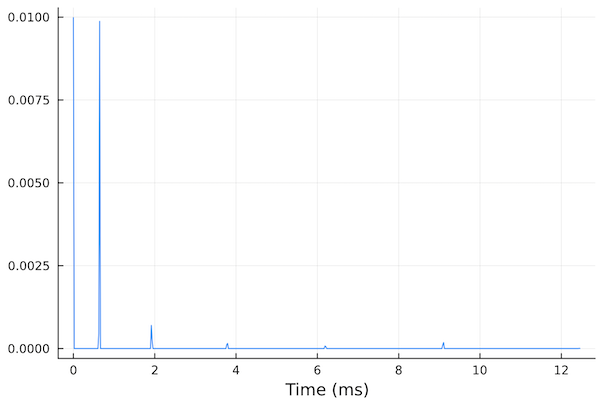
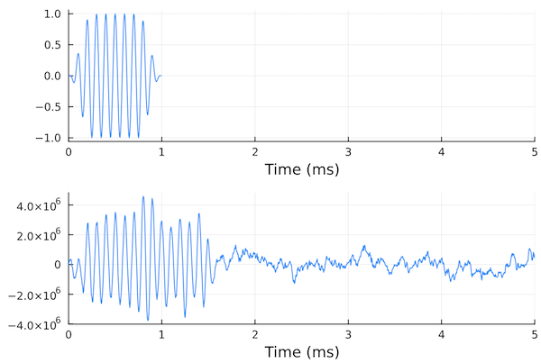

# Propagation & channel modeling

## Overview

The underwater acoustic propagation & channel modeling toolkit provides a framework for modeling and simulating underwater acoustic environments with multiple sources and receivers. The toolkit provides a pluggable interface that allows different propagation models to be used with the same scene description. While `UnderwaterAcoustics.jl` provides several propagation model implementations that can be used out-of-the-box, the interface is designed to allow third party propagation models to be easily plugged in to the toolkit as well.

Available models:

TODO

## Quickstart guide

### Propagation modeling

Let's get started:

```julia-repl
julia> using UnderwaterAcoustics
```

We typically start with an environmental description:

```julia-repl
julia> env = UnderwaterEnvironment()
UnderwaterEnvironment(
  bathymetry = 100.0,
  altimetry = 0.0,
  temperature = 27.0,
  salinity = 35.0,
  soundspeed = 1538.9235842,
  density = 1022.7198310217424,
  seabed = RigidBoundary,
  surface = PressureReleaseBoundary,
)
```

If the defaults don't suit our needs, we can customize the environment. For example, if we wanted an environment with 20 m water depth, sandy-clay seabed, and a smooth soundspeed profile with 1500 m/s near the surface, 1490 m/s at 10 m depth, and 1520 m/s near the seabed, we could define:

```julia-repl
julia> env = UnderwaterEnvironment(
                bathymetry = 20.0, seabed = SandyClay,
                soundspeed = SampledField([1500, 1490, 1520]; z=0:10:20, interp=:cubic)
              )
UnderwaterEnvironment(
  bathymetry = 20.0,
  altimetry = 0.0,
  temperature = 27.0,
  salinity = 35.0,
  soundspeed = SampledField(z-varying, 3 samples),
  density = 1022.7198310217424,
  seabed = FluidBoundary(ρ=1173.381, c=1504.9272, δ=0.00242),
  surface = PressureReleaseBoundary,
)
```

If we have `Plots.jl` installed, we can use plot recipes to plot the environment or the soundspeed profile. For example:

```julia-repl
julia> using Plots
julia> plot(env.soundspeed)
```


We could also use a convenience constructor `PekerisWaveguide()` to quickly construct a range-independent iso-velocity environment:

```julia-repl
env = PekerisWaveguide(h=20, seabed=SandyClay)
UnderwaterEnvironment(
  bathymetry = 20,
  altimetry = 0.0,
  temperature = 27.0,
  salinity = 35.0,
  soundspeed = 1538.9235842,
  density = 1022.7198310217424,
  seabed = FluidBoundary(ρ=1173.381, c=1504.9272, δ=0.00242),
  surface = PressureReleaseBoundary,
)
```

Once we have an environment, we need to select a propagation model. Since we have a range-independent iso-velocity environment, we can use the `PekerisRayTracer`:

```julia-repl
julia> pm = PekerisRayTracer(env)
PekerisRayTracer(h=20, maxbounces=3)
```

Next, we need a source and a receiver:

```julia-repl
julia> tx = AcousticSource(0.0, -5.0, 1000.0)
TX[1000.0 Hz, 0 dB](0.0, 0.0, -5.0)

julia> rx = AcousticReceiver(100.0, -10.0)
RX(100.0, 0.0, -10.0)
```

For improved readability, positions can be specified as tuples or named tuples, and the API fully supports `Unitful.jl`:

```julia-repl
julia> tx = AcousticSource((x=0u"m", z=-5u"m"), 1u"kHz")
TX[1000 Hz, 0 dB](0.0, 0.0, -5.0)

julia> rx = AcousticReceiver(100u"m", -10u"m")
RX(100.0, 0.0, -10.0)
```

!!! note

    2-tuples are interpreted as `(x, z)` and 3-tuples as `(x, y, z)`. The coordinate system has `x` and `y` axis in the horizontal plane, and `z` axis pointing upwards, with the nominal water surface being at 0 m. This means that all `z` coordinates in water are negative. If units are not specified, they are assumed to be S.I. units (meters for distances, Hz for frequency, etc).

We just defined an omnidirectional 1 kHz transmitter `tx` at a depth of 5 m at the origin, and an omnidirectional receiver `rx` at a range of 100 m and a depth of 10 m.

Now that we have an environment, a propagation model, a transmitter and a receiver, we can modeling. First, we ask for all ray arrivals (eigenrays) between the transmitter and receiver:

```julia-repl
julia> rays = arrivals(pm, tx, rx)
7-element Vector{UnderwaterAcoustics.RayArrival}}}:
 ∠ -2.9°  0⤒  0⤓ ∠  2.9° |  65.06 ms | -40.0 dB ϕ  -0.0°↝
 ∠  8.5°  1⤒  0⤓ ∠  8.5° |  65.71 ms | -40.1 dB ϕ-180.0°↝
 ∠-14.0°  0⤒  1⤓ ∠-14.0° |  66.98 ms | -62.6 dB ϕ 170.9°↝
 ∠ 19.3°  1⤒  1⤓ ∠-19.3° |  68.85 ms | -74.3 dB ϕ -23.4°↝
 ∠-24.2°  1⤒  1⤓ ∠ 24.2° |  71.26 ms | -80.4 dB ϕ-145.6°↝
 ∠ 28.8°  2⤒  1⤓ ∠ 28.8° |  74.16 ms | -73.5 dB ϕ  10.8°↝
 ∠-33.0°  1⤒  2⤓ ∠-33.0° |  77.50 ms | -100.7 dB ϕ-167.2°↝
```

For each eigenray, this shows us the launch angle, number of surface bounces, number of bottom bounces, arrival angle, travel time, transmission loss along that ray, and phase change. The last "↝" symbol indicates that the complete ray path is also available. We can plot the ray paths:

```julia-repl
julia> plot(env; xlims=(-10,110))
julia> plot!(tx)
julia> plot!(rx)
julia> plot!(rays)
```


The red star is the transmitter and the blue circle is the receiver. The stronger eigenrays are shown in blue, while the weaker ones are shown in red.

Often, we are interested in the arrival structure at a receiver. We generate an impulse response sampled at 48 kSa/s and plot it:

```julia-repl
julia> plot(impulse_response(pm, tx, rx, 48000))
```



The first arrival is at 0 ms, as the impulse response is generated with timing relative to the first arrival. If we wanted timings relative to the transmission time, we can set keyword argument `abstime` to `true`:

```julia-repl
julia> impulse_response(pm, tx, rx, 48000; abstime=true)
SampledSignal @ 48000.0 Hz, 3722-element Vector{ComplexF64}:
                   0.0 + 0.0im
                   0.0 + 0.0im
                   0.0 + 0.0im
                       ⋮
                   0.0 + 0.0im
                   0.0 + 0.0im
 -8.670019088250974e-6 - 1.9681309626327414e-6im
 -2.252165006859498e-6 - 5.112509716345214e-7im
```

We can also get the complex acoustic field or the transmission loss in dB:

```julia-repl
julia> acoustic_field(pm, tx, rx)
0.011324623966682422 + 0.013441466103602584im

julia> transmission_loss(pm, tx, rx)
35.10153806536334
```

We can also pass in arrays of receivers, if we want to compute transmission loss at many locations simultaneously. Some models are able to compute transmission loss on a Cartesian grid very efficiently. This is useful to plot transmission loss as a function of space.

To define a 1000×200 Cartesian grid with 0.1 m spacing and compute the transmission loss over the grid:

```julia-repl
julia> rxs = AcousticReceiverGrid2D(1.0:0.1:100, -20:0.1:0)
991×201 AcousticReceiverGrid2D:
 RX(1.0, 0.0, -20.0)    RX(1.0, 0.0, -19.9)   …  RX(1.0, 0.0, -0.1)    RX(1.0, 0.0, 0.0)
 RX(1.1, 0.0, -20.0)    RX(1.1, 0.0, -19.9)      RX(1.1, 0.0, -0.1)    RX(1.1, 0.0, 0.0)
 RX(1.2, 0.0, -20.0)    RX(1.2, 0.0, -19.9)      RX(1.2, 0.0, -0.1)    RX(1.2, 0.0, 0.0)
 ⋮                                            ⋱                              ⋮
 RX(99.8, 0.0, -20.0)   RX(99.8, 0.0, -19.9)     RX(99.8, 0.0, -0.1)   RX(99.8, 0.0, 0.0)
 RX(99.9, 0.0, -20.0)   RX(99.9, 0.0, -19.9)     RX(99.9, 0.0, -0.1)   RX(99.9, 0.0, 0.0)
 RX(100.0, 0.0, -20.0)  RX(100.0, 0.0, -19.9) …  RX(100.0, 0.0, -0.1)  RX(100.0, 0.0, 0.0)

julia> x = transmission_loss(pm, tx, rxs)
991×201 Matrix{Float64}:
 19.1283  19.2328  19.5428  19.8492  …   8.82646  11.1099  16.4209  87.1227
 19.1329  19.2373  19.5471  19.8536      8.87496  11.1689  16.4855  87.123
 19.1381  19.2424  19.552   19.8586      8.92702  11.2323  16.5549  87.1233
  ⋮                                  ⋱                               ⋮
 37.5882  37.6646  37.7151  37.7428     58.0112   61.4877  67.3819  98.2904
 37.6269  37.7053  37.7578  37.7876     58.0319   61.5099  67.4075  98.3118
 37.6665  37.7469  37.8014  37.8332  …  58.0524   61.5322  67.4338  98.3333

julia> plot(env; xlims=(0,100))
julia> plot!(rxs, x)
```


### Channel modeling

Once we have a propagation model, we can setup a channel simulation. Let's say we had a 10 kHz source transmitting at a source level of 170 dB re 1 µPa @ 1m and we wanted to run our simulations at 192 kSa/s:

```julia-repl
julia> tx = AcousticSource((x=0u"m", z=-5u"m"), 10u"kHz"; spl=170)
TX[10000 Hz, 170 dB](0.0, 0.0, -5.0)

julia> ch = channel(pm, tx, rx, 192000)
SampledPassbandChannel(1×1, 192000.0 Hz)
```

This channel accepts one input acoustic channel and yields one output acoustic channel. To transmit a signal through the channel, we create a windowed pulse using `SignalAnalysis.jl` and `transmit()` it through the channel `ch`:

```julia-repl
julia> using SignalAnalysis

julia> x = cw(10000, 0.001, 48000; window=(tukey, 0.5)) |> real
SampledSignal @ 192000.0 Hz, 192-element Vector{Float64}:
  0.0
  0.001024363917860783
  0.003429200834120551
  ⋮
  0.002401404027345493
  0.0008582286175031586
  0.0

julia> y = transmit(ch, x)
SampledSignal @ 192000.0 Hz, 2582×1 Matrix{Float64}:
       1.4305114746093751e-10
     911.9778733210743
    5131.695708356095
       ⋮
      -5.325607896712335
      -1.2107583136823128
      -0.03914106336493348

julia> plot(plot(x; xlims=(0,5)), plot(y; xlims=(0,5)); layout=(2,1))
```


The received signal is scaled to be in µPa, assuming the source level of the transmitter was specified in dB re 1 µPa @ 1 m. We can clearly see the multipath arrivals in the received signal. Had we specified keyword argument `abstime = true`, we would have also seen the signal delayed by 65 ms.

We can also simulate channels with noise. For example, if we wanted red Gaussian noise with standard deviation `σ = 0.5` Pa, we can specify that when generating the channel:

```julia-repl
julia> ch = channel(pm, tx, rx, 192000; noise=RedGaussianNoise(0.5e6))
SampledPassbandChannel(1×1, 192000.0 Hz)

julia> y = transmit(ch, x)
SampledSignal @ 192000.0 Hz, 2582×1 Matrix{Float64}:
  -32743.09138922932
  174636.00222730247
  237438.7939411804
       ⋮
  246274.04596141595
  292523.1817733165
   -4075.629852640734

julia> plot(plot(x; xlims=(0,5)), plot(y; xlims=(0,5)); layout=(2,1))
```



We can see the noise in the timeseries. We can see the `1/f²` variation in the power spectral density superimposed on the 10 kHz peak from the transmitted pulse:

```julia-repl
julia> psd(y)
```


