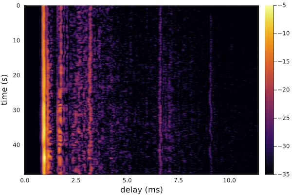
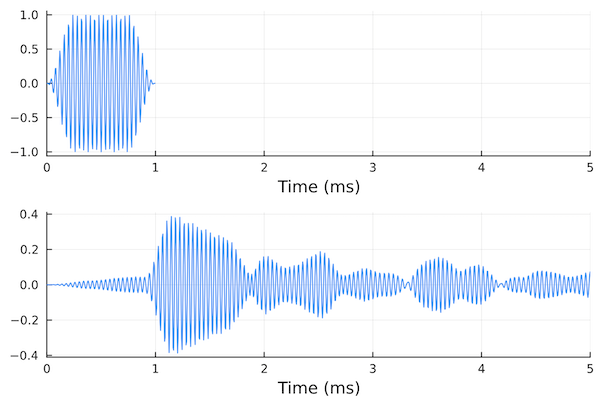
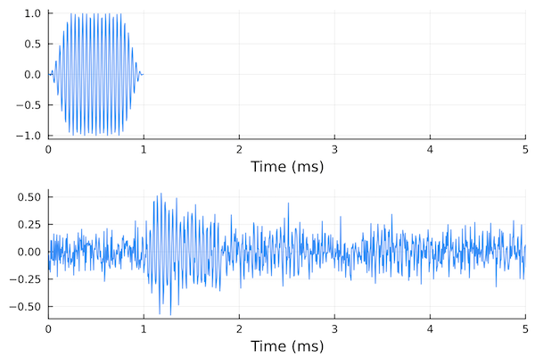

# Channel replay

The idea of channel replay was popularized in the underwater domain by the [Watermark benchmark](https://ieeexplore.ieee.org/document/7932436). The essential idea is to extract estimates of time-varying impulse response (TVIR) from measurements at sea, and to convolve it with a new signals to estimate what would have been received had that signal been transmitted during the measurement.

To do channel replay using `UnderwaterAcoustics.jl`, we build a `AbstractAcousticChannel` from the measured TVIR using the `BasebandReplayChannel()` constructor. It can either take in a TVIR as a matrix or load a TVIR from file (e.g. `red.mat`):

```julia-repl
julia> ch = BasebandReplayChannel("red.mat")
BasebandReplayChannel(4 × 48.6 s, 25000.0 Hz, 19200.0 Sa/s)
```

This channel has 4 receiving hydrophones and can replay up to 48.6 seconds of signal through the measured TVIR. The signal must fit within the frequency band that was used to probe the channel (for the `red` channel it is 25 ± 4.8 kHz).

We can visualize the TVIR for the first hydrophone by plotting it:

```julia-repl
julia> plot(ch)
```


If we were interested in the second hydrophone, we could specify the hydrophone number to plot:

```julia-repl
julia> plot(ch, 2)
```



To pass a signal through the channel, we generate a signal and `transmit()` it just like through any other `AbstractAcousticChannel`:

```julia-repl
julia> using SignalAnalysis

julia> x = cw(25000, 0.001, 192000; window=(tukey, 0.5)) |> real
SampledSignal @ 192000.0 Hz, 192-element Vector{Float64}:
  0.0
  0.0007394920352708446
 -0.00028269933952476754
  ⋮
 -0.0033412704741147374
 -7.075137184015532e-5
  0.0

julia> y = transmit(ch, x; start=1)
SampledSignal @ 192000.0 Hz, 2390×4 Matrix{Float64}:
 -2.30611e-7  -1.68893e-6   -1.12289e-6   -2.03046e-7
 -4.2468e-6   -8.8984e-6     7.00465e-6    4.47588e-6
 -1.33753e-5   3.58085e-6    4.19415e-5    1.89436e-5
  ⋮
 -1.52067e-5  -1.25168e-5    1.74879e-5   -8.6773e-6
 -9.10566e-6  -7.55073e-6    1.41636e-5   -9.44784e-6
 -1.11559e-6  -1.0776e-6     3.74317e-6   -3.3932e-6
```

We have 4 channels of received data since we have 4 hydrophones in the replay TVIR. We plot the transmitted signal and the first 5 ms of the replayed received signal (hydrophone 2):

```julia-repl
julia> plot(plot(x; xlims=(0,5)), plot(y[:,2]; xlims=(0,5)); layout=(2,1))
```



We can also simulate channels with noise. For example, if we wanted white Gaussian noise with standard deviation `σ = 0.1`, we can specify that when loading the channel:

```julia-repl
julia> ch = BasebandReplayChannel("red.mat"; noise=WhiteGaussianNoise(0.1))
BasebandReplayChannel(4 × 48.6 s, 25000.0 Hz, 19200.0 Sa/s)

julia> y = transmit(ch, x; start=1)
SampledSignal @ 192000.0 Hz, 2390×4 Matrix{Float64}:
  0.0343439   -0.0254487    -0.125104    0.106963
  0.0368721   -0.0329021    -0.0903449   0.192257
  0.0759043   -0.163399     -0.192695    0.0469046
  ⋮
 -0.151341     0.107728      0.108777    0.137165
  0.00158276  -0.0361726    -0.0408454  -0.125252
 -0.0897709    0.000223244  -0.016368   -0.00575499

julia> plot(plot(x; xlims=(0,5)), plot(y[:,2]; xlims=(0,5)); layout=(2,1))
```


